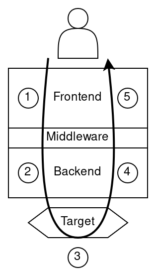

# Architecture

This document explains the architecture of the current implementation.

The main logic of the POD2 implementation is divided into three modules:
- frontend
    - compiles user-friendly pod declarations into intermediate representations to be consumed by the backend
    - internally connects to the backend to get pods built (proved).
    - presents pods to the user
- middleware
    - defines the intermediate representation of Statements, Operations and interfaces of PODs
    - Statements and Operations are strongly typed here
    - Both frontend and backend use types defined in the middleware
    - Does not import types from frontend nor backend
- backend
    - takes a middleware POD request representation, signs/proves it and returns a generic POD object

If this was the Rust language compiler:
- frontend: takes a Rust code and compiles it to LLVM-IR
- middleware: defines LLVM-IR instructions and blocks
- backend: Takes LLVM-IR instructions and emits assembly code for a particular CPU

The following diagram shows visually how the components interact with each other:

In this organization, the middleware could be defined at arbitrary points:
- closer to the user would be more high level
- closer to the target would be more low level

All these positions are OK.  We just need to choose one, and we can try to choose a point that simplifies the implementation.

For example in the middleware we could define `Value = 4 x Goldilock` (making it slightly low level); or `Value = BigUint` and letting the backend choose the maximum representable value, the field encoding, etc. (making it slightly higher level).

In the current iteration we choose `Value = 4 x Goldilock`, but we can revisit it in a future iteration (eg. if we want to support plonky3) by either moving the middleware to a higher level, or by keeping it the same and replacing the `Value` definition.

The diagram above includes an arrow that would show the typical flow followed by a user making a POD.  This is a simplified description of the process.
1. The user interacts with the frontend API and passes a list of Operations.  The frontend takes those operations and generates the corresponding Statements.  The list of Operations and Statements are transformed into middleware types.  This process can be seen as a compilation step.  The frontend sends this middleware data as a request to the Backend.
2. The backend receives a request to build a POD from a list of Statements and Operations.  It takes that bundle of data and lays it out in the appropriate format to be proved by a circuit, padding unused slots, etc.  Then it calls a proof system API to generate a proof.
3. The target (proof system) generates a proof from some circuit description and witness data and gives it back to the backend.
4. The backend receives the proof and encapsulates it in an object that adheres to the Pod trait and passes it to the frontend
5. The frontend receives a "blackbox" Pod object and wraps it in a presentation layer in order to show it to the user.
