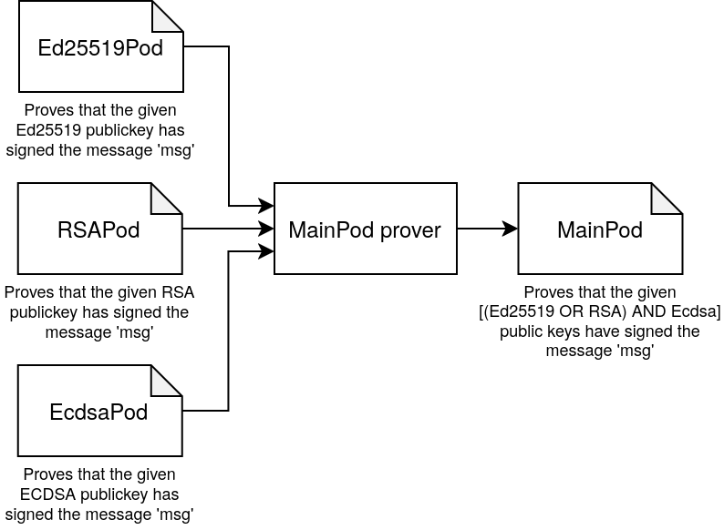
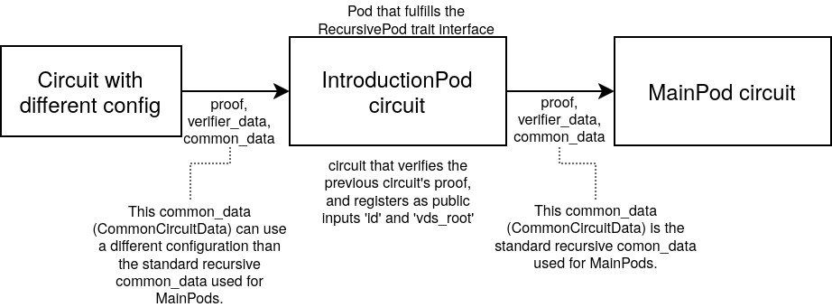
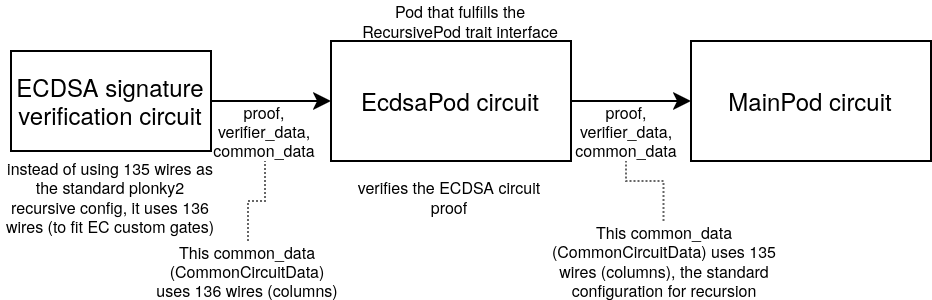

# Introduction PODs

Introduction PODs are a kind of POD used to introduce any cryptographic data
structure into the POD system. This allows the POD system to reason about
cryptographic data and cryptographic primitives that are not part of the POD
system itself.

An example of an IntroductionPod are the `Ed25519Pod` and the `EcdsaPod`, both
of them allowing to incorporate their respective kind of signature schemes that
are not supported in the core of the POD system.
This allows to the POD system to incorporate data validated by those
Introduction PODs, and recursively use it in future proofs combining them with
any logical reasoning together with other PODs.

For example, we could have an scenario where we use 3 different Introduction
PODs (Ed25519Pod, RSAPod, EcdsaPod), to prove that a user controls an Ethereum
wallet *AND* a GitHub account. To do so, the user would produce a new `MainPod`
which proves that the user has signed a certain message with the given ECDSA key
(Ethereum wallet) *AND* with either the given Ed25519 key *OR* the RSA key (from
a GitHub account).

### Interface
The interface of a `IntroductionPod` is just the one of the
[Pod](https://github.com/0xPARC/pod2/blob/511efa8d4477a0d936bd898a484e3b41454b1991/src/middleware/mod.rs#L901)
trait, and by definition the `IntroductionPod` is expected to only output
Introduction statements (or None statements for padding).

An Introduction Statement is a Statement that uses an Introduction predicate
which embeds the verifying key of the circuit that generates it.  This way the
statements generated by an `IntroductionPod` are self-describing.

This means that as long as we fit into the `Pod` interface, the
`IntroductionPod` will fit into the recursive verification chain of the
`MainPods`.

### Different configurations
There are some cases, where the operations needed for the `IntroductionPod`
require a different circuit configuration than the standard recursive circuit
configuration that is used for the `MainPods`.

In those cases, we do a previous recursive step, where we verify the logic of
the intended `IntroductionPod`, and then the proof of this circuit is the one
verified in the real `IntroductionPod`.

This is done in order to be able to *converge* the different circuit
configuration shape (and thus different `common_data`) into a new proof that can
be verified with the standard configuration (used for the MainPods).

Notice that this is not a requirement for implementing a new `IntroductionPod`,
and if the IntroductionPod logic can be directly verified with the standard
recursion configuration, we don't need this previous recursive step.

As examples of the two-recursive steps approach, we have the `EcdsaPod` and the
`Ed25519Pod`. Both of them, require different circuit configurations that would
not match the one used for the standard recursion with `MainPods`. Therefore we
first generate a circuit proof of correct signature verification, and then this
proof is the one actually verified in the `EcdsaPod`/`Ed25519Pod` respectively,
not the original signature itself.

> Examples of `IntroductionPods` can be found at the git repository
> [github.com/0xPARC/introduction-pods](https://github.com/0xPARC/introduction-pods/).
