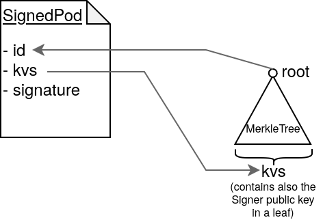

# SignedPod

A SignedPod consists of the following fields:
- `mt`: key-values storage, internally it's a [MerkleTree](./merkletree.md) so that we can generate proofs on the key-values
	- it can only contain [`ValueOf` statements](./statements.md).
	- the Signer's public key is one of the key-values in the `kvs`.
- `id`: the Root of the `kvs` MerkleTree
- `signature`: a signature over the `id`

<br>




Example of SignedPod:
```javascript
{
    id: "05f7a6de...",
    kvs : {
        _signerKey: "5e1c0b3c...",
        idNumber: "94e328a7...",
        dateOfBirth: 1169909384,
        socialSecurityNum: "1111"
    },
    signature: "68b615f7..."
}
```
